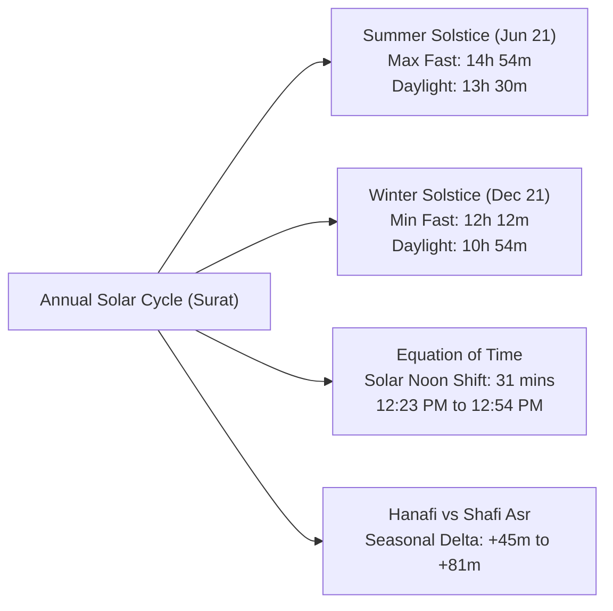
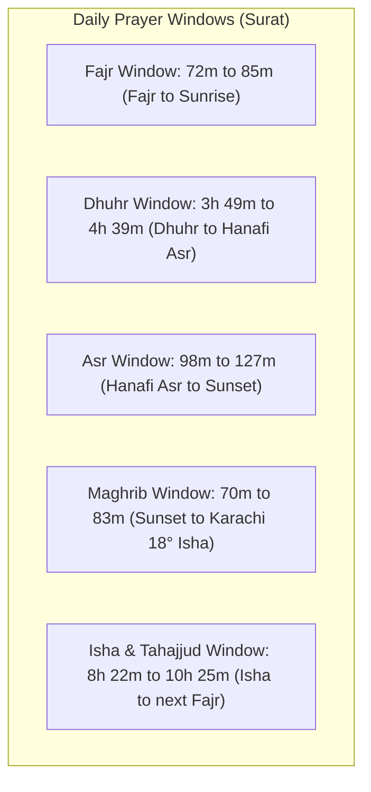
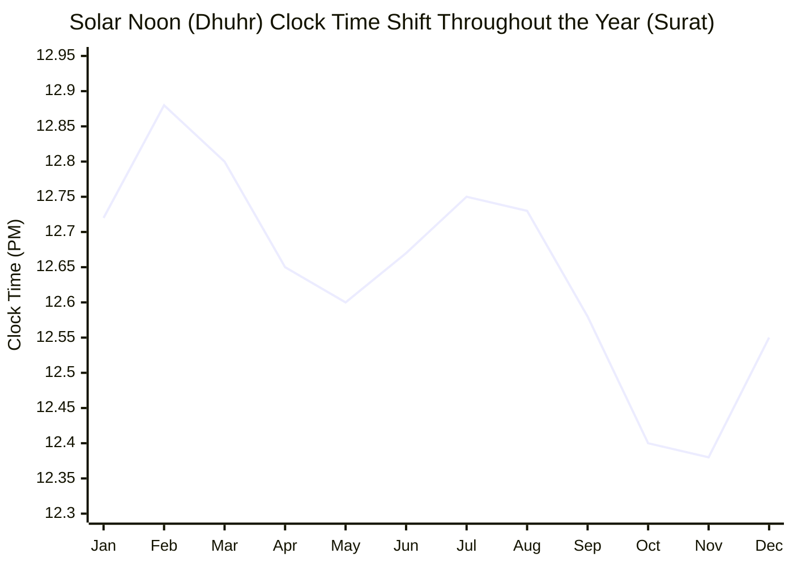

# Comprehensive Annual Astronomical & Prayer Timing Analysis
## Adajan Patiya, Surat, Gujarat (21.1960° N, 72.7940° E)
### Calibration: Karachi 18°/18° • Strict Hanafi Juristic Shadow (Misl-e-Sani) • Precautionary Buffers Included

---

## 1. Executive Summary & All-Time Extremes (Annual Range)

This study provides an exhaustive astronomical and juristic analysis of prayer timings for the default location **Adajan Patiya, Surat**. Calculations are computed dynamically using high-precision Jean Meeus solar algorithms, calibrated to the **Karachi University of Islamic Sciences 18°/18° depression standard**, with Asr determined strictly by **Imam Abu Hanifa's 2× shadow rule (*Misl-e-Sani*)**, and standard Indian mosque precautionary margins (-3m Suhoor, +3m Maghrib).



### Annual Prayer Extremes Matrix (Year 2026 / 2027)

| Prayer / Event | Earliest Occurrence | Latest Occurrence | Total Annual Shift |
| :--- | :--- | :--- | :--- |
| **Fajr (Dawn)** | **04:32 AM** &bull; *Sat, 06 Jun* | **06:02 AM** &bull; *Tue, 20 Jan* | **1 hour 30 mins** |
| **Sehri Cut-Off (-3m)** | **04:29 AM** &bull; *Sat, 06 Jun* | **05:59 AM** &bull; *Tue, 20 Jan* | **1 hour 30 mins** |
| **Sunrise** | **05:56 AM** &bull; *Fri, 29 May* | **07:18 AM** &bull; *Fri, 09 Jan* | **1 hour 22 mins** |
| **True Solar Noon (Dhuhr)** | **12:23 PM** &bull; *Sun, 25 Oct* | **12:54 PM** &bull; *Mon, 09 Feb* | **31 mins** |
| **Shafi Asr (1× Shadow)** | **03:34 PM** &bull; *Fri, 27 Nov* | **04:13 PM** &bull; *Sat, 28 Feb* | **39 mins** |
| **Hanafi Asr (2× Shadow)** | **04:21 PM** &bull; *Fri, 27 Nov* | **05:28 PM** &bull; *Sun, 12 Jul* | **1 hour 07 mins** |
| **Maghrib / Iftar (Sunset +3m)**| **05:59 PM** &bull; *Mon, 23 Nov* | **07:28 PM** &bull; *Fri, 26 Jun* | **1 hour 29 mins** |
| **Isha (Karachi 18.0°)** | **07:14 PM** &bull; *Mon, 16 Nov* | **08:50 PM** &bull; *Thu, 25 Jun* | **1 hour 36 mins** |

> [!IMPORTANT]
> **Key Finding on Extremes**: Notice that the earliest sunrise does **not** occur on the Summer Solstice (June 21), and the earliest sunset does **not** occur on the Winter Solstice (December 21). Due to the **Equation of Time**, the earliest sunrise occurs on **29 May (05:56 AM)** and the latest sunset occurs on **26 June (07:28 PM)**.

---

## 2. Fasting (Roza) & Ramadan Seasonal Analysis

Fasting duration in Islamic jurisprudence is strictly bounded from **Subh Sadiq (true dawn / Fajr)** until **Ghurub ash-Shams (sunset / Maghrib)**.

### Fasting Duration Extremes in Surat:
- **Longest Fast of the Year**: **14 hours 54 minutes** (Fajr 04:33 AM &rarr; Maghrib 07:27 PM on **Sunday, 21 June 2026**). With the mosque 3-minute Suhoor precautionary buffer, the total fast spans **14 hours 57 minutes**.
- **Shortest Fast of the Year**: **12 hours 12 minutes** (Fajr 05:53 AM &rarr; Maghrib 06:05 PM on **Saturday, 19 December 2026**). With Suhoor buffer, it spans **12 hours 15 minutes**.
- **Seasonal Fasting Swing**: **2 hours and 42 minutes** difference between peak summer and peak winter fasting in Surat.

### Daylight vs. Night Distribution at Astronomical Milestones

```
Summer Solstice (21 Jun): [====== Daylight: 13h 30m ======][==== Night: 10h 30m ====]
Equinoxes (20 Mar / 22 Sep): [==== Daylight: 12h 10m ====][==== Night: 11h 50m ====]
Winter Solstice (21 Dec): [==== Daylight: 10h 54m ====][====== Night: 13h 06m ======]
```

| Event | Date | Day | Daylight (Sunrise &rarr; Sunset) | Fast Length (Fajr &rarr; Maghrib) | Night Length (Sunset &rarr; Sunrise) |
| :--- | :--- | :--- | :--- | :--- | :--- |
| **Summer Solstice** | 21 June | Sunday | **13h 30m** | **14h 54m** | **10h 30m** |
| **Autumnal Equinox** | 22 September | Tuesday | **12h 12m** | **13h 25m** | **11h 48m** |
| **Winter Solstice** | 21 December | Monday | **10h 54m** | **12h 12m** | **13h 06m** |
| **Vernal Equinox** | 20 March | Friday | **12h 10m** | **13h 23m** | **11h 50m** |

### The 33-Year Ramadan Lunar Migration Cycle
Because the Islamic Hijri calendar is strictly lunar (354 or 355 days per year), Ramadan shifts backwards by **10 to 12 days every Gregorian solar year**:
- **Ramadan in Winter (e.g., 2030–2035)**: Fasting in Surat is concise and temperate, averaging **12h 15m to 12h 45m**, with Iftar between 06:00 PM and 06:30 PM.
- **Ramadan in Summer (e.g., 2014–2019, and returning ~2047)**: Fasting reaches **14h 50m+**, with Sehri ending before 04:35 AM and Iftar extending past 07:25 PM in humid coastal Gujarat heat.
- Over a **33-year cycle**, a Muslim in Surat experiences Ramadan across all four seasons.

---

## 3. Prayer Window Durations (Available Time to Pray)

A critical practical metric is **Window Duration**: the total elapsed time between the start of one prayer and the start of the next (or forbidden boundary).



### Detailed Window Breakdown:

#### 1. Fajr Window (*Subh Sadiq &rarr; Shuruq*)
- **Shortest Window**: **72 minutes** (*Sunday, 08 March*) — In early spring, the sun's path cuts steeply toward the horizon, causing twilight to pass swiftly.
- **Longest Window**: **85 minutes** (*Monday, 22 June*) — Around the summer solstice, the sun traverses the horizon at an oblique angle, elongating twilight to nearly 1.5 hours.

#### 2. Dhuhr Window (*Zawal clearance &rarr; Hanafi Asr*)
- **Shortest Window**: **3 hours 49 minutes** (*Wednesday, 16 December*) — In mid-winter, low solar altitude causes shadow lengths to multiply quickly.
- **Longest Window**: **4 hours 39 minutes** (*Wednesday, 24 June*) — In summer, the sun hovers near zenith, delaying the 2× shadow factor.

#### 3. Asr Window (*Hanafi Asr &rarr; Maghrib*)
- **Shortest Window**: **98 minutes (1h 38m)** (*Friday, 02 January*) — Winter Asr is brief; worshippers must be prompt.
- **Longest Window**: **127 minutes (2h 07m)** (*Tuesday, 26 May*) — Over 2 hours of available Asr time in late spring.

#### 4. Maghrib Twilight Window (*Maghrib &rarr; Isha 18°*)
- **Shortest Window**: **70 minutes (1h 10m)** (*Wednesday, 04 March*) — Fastest disappearance of white twilight (*Shafaq Abyad*).
- **Longest Window**: **83 minutes (1h 23m)** (*Tuesday, 16 June*) — Longest twilight lingering in the northern sky.

#### 5. Tahajjud / Qiyam al-Layl Window (*Last Third of the Night*)
- **Winter (Dec–Jan)**: The night spans over 13 hours. The last third begins around **01:40 AM** and lasts until **05:55 AM** (**~4 hours 15 mins** of prime Tahajjud time).
- **Summer (Jun–Jul)**: The night shrinks to 10.5 hours. The last third begins around **02:40 AM** and ends at **04:32 AM** (**under 2 hours**).

---

## 4. Astronomical Mechanisms & Solar Anomalies in Surat

### The 31-Minute Solar Noon Shift (Equation of Time)

Many people assume Dhuhr (solar noon) always occurs at 12:00 PM or at a constant clock time. In reality, **true solar noon shifts by 31 minutes** in Surat:



- **Earliest Dhuhr of the year**: **12:23 PM** (*25 October to 04 November*)
- **Latest Dhuhr of the year**: **12:54 PM** (*06 February to 14 February*)

#### Why does this happen?
1. **Earth's Elliptical Orbit (Kepler's Second Law)**: Earth travels faster at perihelion (January) and slower at aphelion (July).
2. **Earth's 23.44° Obliquity (Axial Tilt)**: The sun's apparent motion along the ecliptic projects unevenly onto the celestial equator.
Together, these factors form the **Equation of Time (EoT)**, causing the solar clock to run up to 14 minutes behind standard clock time in February, and up to 16 minutes ahead in November.

### The Solstice vs. Extremes Asymmetry
Why do the earliest sunrise and latest sunset **not** occur on the Summer Solstice (June 21)?
- In mid-June, solar noon is shifting later each day by ~12 seconds per day due to the Equation of Time.
- This daily rightward clock shift pulls **both sunrise and sunset forward** into later clock times.
- As a result:
  - Sunrise reaches its earliest point on **29 May (05:56 AM)**, well before the solstice.
  - Sunset continues shifting later until **26 June (07:28 PM)**, several days after the solstice.
  - On the Solstice itself (June 21), daylight length reaches its maximum (**13h 30m**), but the bounds are asymmetrical (**05:57 AM to 07:27 PM**).

---

## 5. Juristic Study: Hanafi vs. Shafi Asr Comparison

In Islamic jurisprudence, there is a celebrated scholarly difference regarding the start of Asr:
- **Jumhoor (Imams Shafi, Malik, Ahmad)**: Asr begins when the shadow of an upright object equals its height plus noon shadow (*Misl-e-Awwal*, factor 1.0).
- **Imam Abu Hanifa (رحمه الله)**: Asr begins when the shadow equals **twice** its height plus noon shadow (*Misl-e-Sani*, factor 2.0).

### Seasonal Analysis of the Hanafi Delta in Surat:

| Season | Typical Month | Shafi Asr | Hanafi Asr | Hanafi Delta | Asr Window (Hanafi &rarr; Maghrib) |
| :--- | :--- | :--- | :--- | :--- | :--- |
| **Mid-Winter** | January 15 | 03:56 PM | 04:42 PM | **+46 minutes** | 1 hour 39 minutes |
| **Spring** | April 15 | 04:04 PM | 05:09 PM | **+65 minutes** | 1 hour 52 minutes |
| **Mid-Summer** | June 15 | 03:59 PM | 05:18 PM | **+79 minutes** | 2 hours 07 minutes |
| **Peak Delta** | July 15 | 04:00 PM | 05:21 PM | **+81 minutes** | 2 hours 06 minutes |
| **Autumn** | October 15 | 03:46 PM | 04:38 PM | **+52 minutes** | 1 hour 41 minutes |

> [!TIP]
> **Astronomical Reason for the Variable Delta**:
> In winter, the sun sits low in the southern sky (noon altitude ~45°). Once it passes noon, shadows lengthen very rapidly; extending the shadow from 1× to 2× object height takes **only 45 to 47 minutes**.
> In summer, the sun passes directly overhead (noon altitude ~92° in Surat, reaching the Tropic of Cancer nearby). Shadows lengthen very slowly, taking **1 hour and 21 minutes** to grow from 1× to 2×.

### Forbidden Times (*Awqat-e-Makruha Tahrimi*)
Islamic jurists unanimously rule that voluntary prayer (*Nafal*) and funeral prayers (*Janazah*) without prior cause are **strictly prohibited (Makruh Tahrimi)** during three solar intervals:
1. **Sunrise (*Tulu*)**: From initial solar disc breach until the sun rises a spear's height (~15–20 minutes, marked by *Ishraq*).
2. **Solar Meridian (*Zawal / Nisf an-Nahar*)**: From approximately 12–15 minutes before true solar noon until the sun crosses the meridian. In Surat, this forbidden window occurs between **12:11 PM &ndash; 12:23 PM in November**, and between **12:40 PM &ndash; 12:54 PM in February**.
3. **Sunset (*Ghurub*)**: When the solar disc yellows until sunset (~15–20 minutes before Maghrib, except for that day's Asr Fard if delayed due to necessity).

---

## 6. 24-Point Comprehensive Reference Almanac (Surat 2026/2027)

*All times computed for Adajan Patiya, Surat (Hanafi 2×, Karachi 18°, Mosque buffers).*

| Date | Day | Fajr | Sunrise | Dhuhr | Shafi Asr | Hanafi Asr | Maghrib | Isha | Fast Length | Daylight | Hanafi Gap |
| :--- | :--- | :--- | :--- | :--- | :--- | :--- | :--- | :--- | :--- | :--- | :--- |
| **01 Jan** | Thu | 05:58 AM | 07:16 AM | 12:43 PM | 03:48 PM | 04:33 PM | 06:12 PM | 07:28 PM | 12h 14m | 10h 56m | +45m |
| **15 Jan** | Thu | 06:01 AM | 07:18 AM | 12:49 PM | 03:56 PM | 04:42 PM | 06:21 PM | 07:36 PM | 12h 20m | 11h 03m | +46m |
| **01 Feb** | Sun | 06:00 AM | 07:16 AM | 12:53 PM | 04:06 PM | 04:53 PM | 06:32 PM | 07:45 PM | 12h 32m | 11h 16m | +47m |
| **15 Feb** | Sun | 05:55 AM | 07:09 AM | 12:53 PM | 04:11 PM | 05:01 PM | 06:40 PM | 07:52 PM | 12h 45m | 11h 31m | +50m |
| **01 Mar** | Sun | 05:46 AM | 06:59 AM | 12:52 PM | 04:13 PM | 05:05 PM | 06:46 PM | 07:57 PM | 13h 00m | 11h 47m | +52m |
| **15 Mar** | Sun | 05:34 AM | 06:47 AM | 12:48 PM | 04:12 PM | 05:08 PM | 06:51 PM | 08:02 PM | 13h 17m | 12h 04m | +56m |
| **01 Apr** | Wed | 05:18 AM | 06:32 AM | 12:43 PM | 04:08 PM | 05:09 PM | 06:57 PM | 08:08 PM | 13h 39m | 12h 25m | +61m |
| **15 Apr** | Wed | 05:05 AM | 06:20 AM | 12:39 PM | 04:04 PM | 05:09 PM | 07:01 PM | 08:14 PM | 13h 56m | 12h 41m | +65m |
| **01 May** | Fri | 04:50 AM | 06:08 AM | 12:36 PM | 03:57 PM | 05:09 PM | 07:07 PM | 08:23 PM | 14h 17m | 12h 59m | +72m |
| **15 May** | Fri | 04:40 AM | 06:00 AM | 12:36 PM | 03:53 PM | 05:10 PM | 07:13 PM | 08:31 PM | 14h 33m | 13h 13m | +77m |
| **01 Jun** | Mon | 04:33 AM | 05:56 AM | 12:37 PM | 03:53 PM | 05:13 PM | 07:20 PM | 08:41 PM | 14h 47m | 13h 24m | +80m |
| **15 Jun** | Mon | 04:32 AM | 05:56 AM | 12:40 PM | 03:59 PM | 05:18 PM | 07:25 PM | 08:47 PM | 14h 53m | 13h 29m | +79m |
| **01 Jul** | Wed | 04:36 AM | 06:00 AM | 12:43 PM | 04:02 PM | 05:21 PM | 07:28 PM | 08:50 PM | 14h 52m | 13h 28m | +79m |
| **15 Jul** | Wed | 04:43 AM | 06:05 AM | 12:45 PM | 04:00 PM | 05:21 PM | 07:27 PM | 08:48 PM | 14h 44m | 13h 22m | +81m |
| **01 Aug** | Sat | 04:52 AM | 06:12 AM | 12:46 PM | 04:04 PM | 05:20 PM | 07:22 PM | 08:39 PM | 14h 30m | 13h 10m | +76m |
| **15 Aug** | Sat | 05:00 AM | 06:17 AM | 12:44 PM | 04:05 PM | 05:16 PM | 07:13 PM | 08:28 PM | 14h 13m | 12h 56m | +71m |
| **01 Sep** | Tue | 05:07 AM | 06:22 AM | 12:39 PM | 04:04 PM | 05:08 PM | 06:59 PM | 08:12 PM | 13h 52m | 12h 37m | +64m |
| **15 Sep** | Tue | 05:12 AM | 06:25 AM | 12:35 PM | 04:00 PM | 05:00 PM | 06:46 PM | 07:57 PM | 13h 34m | 12h 21m | +60m |
| **01 Oct** | Thu | 05:17 AM | 06:29 AM | 12:29 PM | 03:53 PM | 04:48 PM | 06:31 PM | 07:42 PM | 13h 14m | 12h 02m | +55m |
| **15 Oct** | Thu | 05:21 AM | 06:34 AM | 12:25 PM | 03:46 PM | 04:38 PM | 06:19 PM | 07:30 PM | 12h 58m | 11h 45m | +52m |
| **01 Nov** | Sun | 05:27 AM | 06:41 AM | 12:23 PM | 03:39 PM | 04:28 PM | 06:07 PM | 07:19 PM | 12h 40m | 11h 26m | +49m |
| **15 Nov** | Sun | 05:33 AM | 06:49 AM | 12:24 PM | 03:35 PM | 04:22 PM | 06:01 PM | 07:15 PM | 12h 28m | 11h 12m | +47m |
| **01 Dec** | Tue | 05:42 AM | 06:59 AM | 12:28 PM | 03:35 PM | 04:21 PM | 05:59 PM | 07:15 PM | 12h 17m | 11h 00m | +46m |
| **15 Dec** | Tue | 05:49 AM | 07:08 AM | 12:34 PM | 03:39 PM | 04:24 PM | 06:03 PM | 07:19 PM | 12h 14m | 10h 55m | +45m |

---

## 7. Practical Worship Takeaways for Masajid & Worshippers in Surat

1. **Jummah & Dhuhr Scheduling**:
   - Because solar noon moves from **12:23 PM** (Nov) to **12:54 PM** (Feb), Masajid fixing Dhuhr/Jummah Azan at 12:45 PM year-round risk falling inside the **forbidden Zawal window** during January and February!
   - **Recommendation**: To ensure safety across all 365 days in Surat, Dhuhr Jamaat should never be called earlier than **01:15 PM &ndash; 01:30 PM**, which guarantees complete clearance of Zawal year-round.

2. **Winter Asr Vigilance**:
   - In December and January, Hanafi Asr starts at **04:21 PM** and Maghrib is already at **05:59 PM**. The total window is just **98 minutes**.
   - With solar yellowing (*Isfirar*) setting in 15 minutes before sunset, the un-disliked time for Asr is only **80 minutes**. Worshippers must pray promptly.

3. **Summer Fajr & Suhoor Discipline**:
   - In May and June, Sehri cut-off is between **04:29 AM and 04:35 AM**.
   - Many people delay sleeping after Isha (which ends after 08:50 PM), leaving barely 6.5 hours of total night.
   - Disciplined early sleep or a midday *Qaylulah* (sunnah nap) is critical to maintain morning Fajr in congregation.

4. **Maghrib Iftar Precision**:
   - Maghrib varies by almost 1.5 hours across the year (05:59 PM to 07:28 PM).
   - In Surat's coastal topography, the horizon has slight atmospheric haze; adhering to the Karachi +3-minute precautionary margin guarantees the solar disc has completely dipped beneath the geometric horizon before breaking fast.

---

*Analysis generated dynamically from the Jean Meeus Astronomical Engine calibrated for Surat (Adajan Patiya), Gujarat, India.*
